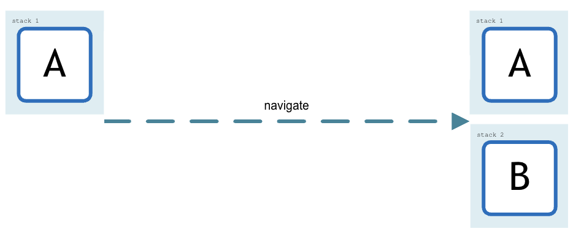
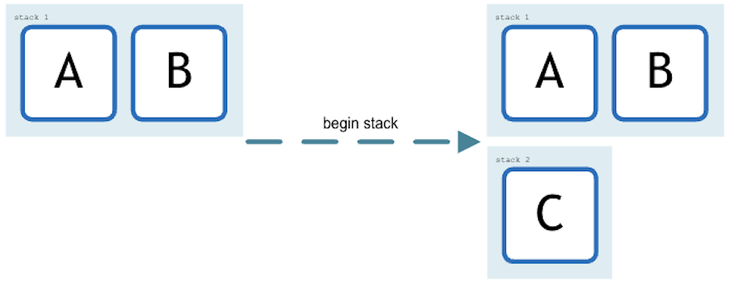
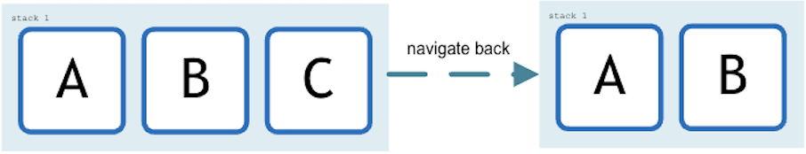
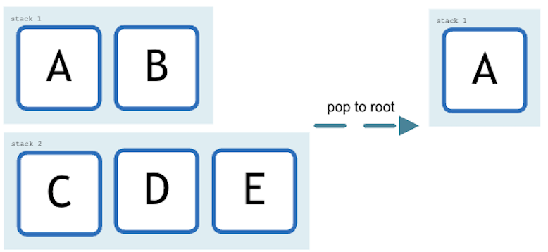

# *Kioto*

#### A lightweight ui framework for compose multiplatform mobile projects.

Kioto is a lightweight and robust ui framework that streamlines navigation management in Compose Multiplatform Mobile applications.
Its structured approach promotes a clear separation of concerns and improves code maintainability across your mobile projects.
---

## Why Kioto?

In the evolving landscape of Compose Multiplatform Mobile development, managing complex navigation flows and maintaining a clean architecture can be challenging.
Kioto addresses these challenges by offering a lightweight and opinionated solution designed to:

* Simplify Navigation: Define your application's UI as modular Node components, making navigation intuitive and easy to reason about.
* Promote Clear Architecture: Enforce a strict separation of concerns, leading to more maintainable and testable code.
* Ensure Multiplatform Consistency: Provide a unified navigation API that works seamlessly across Android and iOS, reducing platform-specific boilerplate.
* Enhance State Management: Leverage a robust state management system within each Node, ensuring predictable UI updates and a responsive user experience.

Kioto helps you build scalable and robust Compose Multiplatform Mobile applications with confidence and efficiency.

| Android                                  | <div style="width:280px">iOS</div> |
|------------------------------------------|------------------------------------|
|  |    |

## Kioto at work

### Node

A `Node` represents a modular portion of your application's UI.
Nodes are presentation logic components that encapsulate their own state and behavior.

To create a Node, you need to extend the `Node` class and define its state.

```kotlin
class MovieAdvisor : Node<MovieAdvisor.State>() {

    data class State(
        val movie: Movie? = null
    )

}
```

States are considered the core component of a Node. Let's see how to work with them.

```kotlin
class MovieAdvisor : Node<MovieAdvisor.State>() {

    data class State(
        val movie: Movie? = null
    )

    init {
        subscribe(::suggestMovie) { updateState { state.copy(movie = this) } } // this refers to the result of the suspend function suggestMovie
    }

}
```

In the example above, when the node is initialized, it subscribes to a suspend function `suggestMovie`.
When this function completes, it updates the node's state with the result. Let's break down in detail the init block:

* `subscribe({}) {  }`

Instances of Node can subscribe to suspend functions and flows by calling `subscribe` and `flowSubscribe` methods respectively.
These subscriptions are cancelled automatically when the node is cleared.

```kotlin
protected fun <T> subscribe(
    source: suspend () -> T,   // The suspend function to subscribe to
    onError: () -> Unit = { }, // Optional error handler
    onCompleted: T.() -> Unit  // The action to perform when the source function completes
)

protected fun <T> flowSubscribe(
    source: suspend () -> Flow<T>, // The suspend function that returns a Flow to subscribe to
    onError: () -> Unit = { },     // Optional error handler
    onNext: T.() -> Unit           // The action to perform on each emitted value
) 
```

* `updateState {  }`

The `updateState` function is used to atomically update the Node's state.

```kotlin
protected fun updateState(
    update: () -> S // A lambda that returns the new state for the node
)
```

* `state.copy(movie = this)`

You can get the current state of the Node using the `state` property.

#### NodeView

To render a Node, you just need to implement a `NodeView` that matches the Node's state. NodeViews are recomposed on any state change.
This ensures your UI automatically updates efficiently whenever the Node's state changes.

```kotlin
class MovieAdvisorView(
    private val listener: ViewListener // The way events are propagated to the Node
) : NodeView<MovieAdvisor.State> {

    @Composable
    override fun Compose(state: MovieAdvisor.State) {
        // Your composable UI code here
    }

    interface ViewListener {
        fun onSeeMore(movie: Movie)
    }

}
```

#### NodeToken

So far, you are able to create a Node and the component that renders it. So it's time to introduce the last Node component that wires up everything together: the `NodeToken`.

```kotlin
class MovieAdvisor : Node<MovieAdvisor.State>() {

    data class State(
        val movie: Movie? = null
    )

    object Token : NodeToken {
        override fun node() = node(::MovieAdvisor, ::State) {
            MovieAdvisorView(object : MovieAdvisorView.ViewListener {
                override fun onSeeMore(movie: Movie) = Unit // Handle the request from the view
            })
        }
    }

    init {
        subscribe(::suggestMovie) { updateState { state.copy(movie = this) } }
    }

}
```

NodeTokens are the glue that binds the Node, its state, and its view together. It tells the system how to instantiate the Node, what its initial state is, and how to create the
corresponding NodeView.
You need to implement the `NodeToken` and override the `node` method to return the result of calling the `node` function.

```kotlin
fun <N : Node<S>, S : Any> node(
    node: () -> N,              // The function that creates the Node instance
    initialState: () -> S,      // The function that provides the initial state for the Node
    view: N.() -> NodeView<S>   // The function that creates the NodeView for the Node, which receives the Node instance as a receiver
): NodeToken.Node
```

NodeTokens can be parameterized, allowing you to pass parameters to the Node's constructor and its initial state.
Look at the example below that takes a `Movie` as a parameter which is used to initialize both, the Node and its view.

```kotlin
class MovieDetail(
    private val movieId: String
) : Node<MovieDetail.State>() {

    object State // Empty state for this example

    class Token(val movie: Movie) : NodeToken {
        override fun node() = node({ MovieDetail(movie.id) }, { State }) {
            MovieView(movie = movie)
        }
    }

}
```

#### Navigation

Nodes can be navigated using the `nav` property available within the `Node` class, which provides a simple API to navigate between nodes.
Let's see how to navigate to another node as a result of an action in the view.

```kotlin
class MovieAdvisor : Node<MovieAdvisor.State>() {

    data class State(
        val movie: Movie? = null
    )

    object Token : NodeToken {
        override fun node() = node(::MovieAdvisor, ::State) {
            MovieAdvisorView(object : MovieAdvisorView.ViewListener {
                override fun onSeeMore(movie: Movie) = nav.navigate { MovieDetail.Token(movie) }
            })
        }
    }

    init {
        subscribe(::suggestMovie) { updateState { state.copy(movie = this) } }
    }

}
```

In the example above, when the user requests to see more details about a movie, the `onSeeMore` method is called, which uses the `nav.navigate` method to navigate to the
`MovieDetail` node.
Note that to navigate to a node, you need to provide the `NodeToken` that represents the destination node. The way tokens are created and the files they are declared is up to you,
although the recommended way to do it is as shown in the examples above.

This navigation solution follows a stack of stacks navigation model, meaning that each node belongs to a stack, which could be shared with other nodes.
The first node added to the first stack is known as the root node, this node is a bit special node because it isn't allowed to share its stack with other nodes.

Let's review the available navigation methods for Nodes:

* `resetNavigation`
  Pops all the stacks and their nodes, and starts a new navigation stack.
<div style="text-align:center"></div>

* `navigate`
  Transitions to the specified node within the current navigation stack, except if called from a root node, in which case it begins a new stack.
<div style="text-align:center">


</div>

* `beginStack`
  Starts a new stack with the specified node as the stack root node.
<div style="text-align:center"></div>

* `replace`
  Replaces the current node with the specified node. Replacing a root node behaves as if `resetNavigation` was called.
<div style="text-align:center"></div>

* `replaceStack`
  Starts a new stack replacing the node's current stack. Replacing the stack of a root node behaves as if `resetNavigation` was called.
<div style="text-align:center"></div>

* `navigateBack`
  Pops the node from the stack.
<div style="text-align:center"></div>

* `navigateUp`
  Pops all the nodes belonging to the node's stack.
<div style="text-align:center"></div>

* `popToRoot`
  Pops all the nodes in the stack until the root node is reached, unless the node that initiates the navigation is a root node, in which case it behaves as if
  `navigateBack` was called.
<div style="text-align:center"></div>

Navigation events are usually triggered by the latest added node, however, there's nothing by design that prevents from navigating from any previous node in the stack.
In that case, all subsequent nodes will first be popped until the node requesting the navigation is reached before handling the navigation request.

### NodeNav

`NodeNav` is the core component that manages navigation under the hood.
NodeNav runs regardless of the UI is rendering nodes or not, you just need to create an instance of it and set a `Node` as the root node to start the navigation process.
There's no limit on the number of `NodeNav` instances you can create, so it's up to you to determine the approach that works best for your application,
you could have a single global reference to a `NodeNav` instance in your application file or use more elaborate solutions like dependency injection to manage it.
For most applications, a single NodeNav instance at the application root is sufficient, but more advanced scenarios might benefit from multiple instances.

```kotlin
val nodeNav = NodeNav().apply {
    setNavigation { Demo.Token } // Set the initial navigation token
}
```

In the example above, a `NodeNav` instance is created and `setNavigation` is called to set the initial navigation node.
Calling `setNavigation` again will clear any previous navigation state and start a new one.

#### Present

Sometimes you may find scenarios where you need your users to interact with the UI from events triggered from outside of the regular UI navigation flow.
Such as opening a push notification from the notifications center, a second factor authentication request, or a required pending terms acceptance that you discover during a login
process.
For these cases, you can leverage `presentStack` or `awaitPresentStack` to start a new stack with a node that will be presented to the user, allowing them to interact with it and
then return to the previous
navigation state.

* `presentStack` presents a new stack on top of any existing stacks.

```kotlin
fun presentDebitCardPaymentOperation(operationId: String) {
    // Presents a new stack with the DebitCardPaymentDetail node on top of any existing stacks if any
    nodeNav.present { DebitCardPaymentOperation.Token(operationId = operationId) }
}
```

`awaitPresentStack` is a suspend function, coroutine execution is suspended until the presented stack is dismissed.

```kotlin
suspend fun authenticate(authenticate: (code: String) -> Boolean) {
    nodeNav.present { SecondFactorAuthentication.Token(authenticate) } // Suspended until SecondFactorAuthentication is dismissed
}

class SecondFactorAuthentication(
    private val auth: suspend (String) -> Boolean
) : Node<SecondFactorAuthentication.State>() {

    data class State(
        val isAuthenticating: Boolean = false,
        val invalidCodeError: Boolean = false
    )

    class Token(val auth: (String) -> Boolean) : NodeToken {
        override fun node() = node({ SecondFactorAuthentication(auth) }, ::State) {
            SecondFactorAuthenticationView(
                listener = object : SecondFactorAuthenticationView.ViewListener {
                    override fun onAuthenticate(code: String) = authenticate(code)
                }
            )
        }
    }

    fun authenticate(code: String) {
        updateState { state.copy(isAuthenticating = true) }
        subscribe(
            source = { auth(code) },
            onError = { updateState { state.copy(isAuthenticating = false, invalidCodeError = true) } },
            onCompleted = { nav.navigateUp() }
        )
    }

}
```

#### Predictive back gesture

Kioto supports predictive back gestures, allowing users to navigate back in the navigation stack by swiping from the edges (from the right only available on Android) of the screen.
Follow official Android documentation to enable predictive back gesture in your Android
application: [Predictive back gesture](https://developer.android.com/guide/navigation/predictive-back-gesture).

| Android                                       | <div style="width:280px">iOS</div>    |
|-----------------------------------------------|---------------------------------------|
|  |  |

#### Root parent supplier

When instantiating a `NodeNav`, you can provide a `rootParentSupplier` that will be used to determine the parent of the root node.
Sometimes you may start a navigation from a node that is not the usual root node, for example, when opening the app from a notification or a deep link and you want your users
to go through a specific node after leaving the app, for example, a home or dashboard node.

```kotlin
internal val nodeNav = NodeNav { token ->
    // Any node other than Demo will have Demo as its parent.
    if (token != Demo.Token) Demo.Token else null
}.apply {
    // Initialize the navigation with the first node.
    setNavigation { Demo.Token }
}
```

### Android

Use `NodeHost` composable function to render a `NodeNav` instance in your Android application.

```kotlin
// Android 
class MainActivity : AppCompatActivity() {

    override fun onCreate(savedInstanceState: Bundle?) {
        super.onCreate(savedInstanceState)
        enableEdgeToEdge()
        setContent {
            NodeHost(
                navigation = nodeNav, // The NodeNav instance to be rendered 
                onStackCleared = { Demo.Token } // A fallback node to be shown in case the stack is cleared
            )
        }
    }

}
```

### iOS

Use `nodeHost` function which returns a `UIViewController` to render a `NodeNav` instance in your iOS application.

```kotlin
object ExampleIOsApplication {

    fun getNodeNavUIViewController() = nodeHost(
        navigation = nodeNav, // The NodeNav instance to be rendered
        onStackCleared = { Demo.Token } // A fallback node to be shown in case the stack is cleared
    )

}
```

```swift
@main
struct iOSApp: App {
    var body: some Scene {
        WindowGroup {
            NodeNavRenderer()
                .ignoresSafeArea(.all)
        }
    }
}

struct NodeNavRenderer: UIViewControllerRepresentable {
    func makeUIViewController(context: Context) -> UIViewController {
        ExampleIOsApplication().getNodeNavUIViewController()
    }

    func updateUIViewController(_ uiViewController: UIViewController, context: Context) {
    }
}
```

#### CompositionLocals

Kioto provides the following composition locals:

* `LocalPlatform` Provides the current platform type, which can be used to conditionally render platform-specific UI components.

```kotlin
val platform = LocalPlatform.current
val text = when (platform) {
    Platform.ANDROID -> Text("Android")
    Platform.IOS -> Text("iOS")
}
Text(text = "Platform: $text")
```

* `LocalNodeNavigation` Provides the current `NodeNavigation` instance, which can be used to request a back navigation.

```kotlin
val nodeNavigation = LocalNodeNavigation.current
IconButton(onClick = { nodeNavigation?.onBackPressed() }) {
    Icon(imageVector = Icons.AutoMirrored.Default.ArrowBack, contentDescription = "Back")
}
```

## License

```
Copyright 2025 Wokdsem

Licensed under the Apache License, Version 2.0 (the "License");
you may not use this file except in compliance with the License.
You may obtain a copy of the License at

http://www.apache.org/licenses/LICENSE-2.0

Unless required by applicable law or agreed to in writing, software
distributed under the License is distributed on an "AS IS" BASIS,
WITHOUT WARRANTIES OR CONDITIONS OF ANY KIND, either express or implied.
See the License for the specific language governing permissions and
limitations under the License.
```
